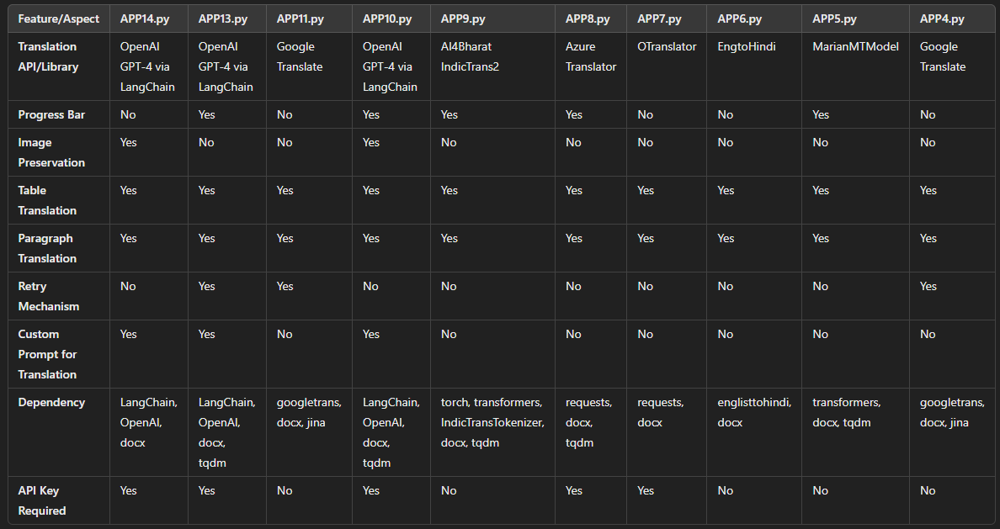
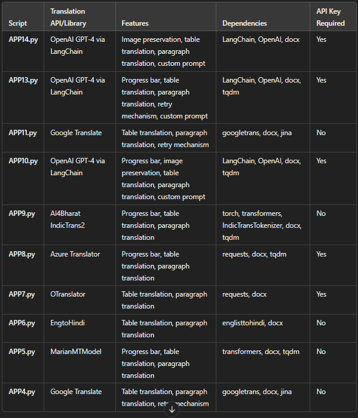

# english_to_hindi_docs
# Document Translator

This repository contains multiple Python scripts for translating DOCX documents from English to Hindi using various translation APIs and libraries. Each script has its own unique features and dependencies.

## Scripts Overview

## Comparison Table





### APP14.py
- **Translation API/Library**: OpenAI GPT-4 via LangChain
- **Features**: Image preservation, table translation, paragraph translation, custom prompt for translation
- **Dependencies**: LangChain, OpenAI, docx
- **API Key Required**: Yes

### APP13.py
- **Translation API/Library**: OpenAI GPT-4 via LangChain
- **Features**: Progress bar, table translation, paragraph translation, retry mechanism, custom prompt for translation
- **Dependencies**: LangChain, OpenAI, docx, tqdm
- **API Key Required**: Yes

### APP11.py
- **Translation API/Library**: Google Translate
- **Features**: Table translation, paragraph translation, retry mechanism
- **Dependencies**: googletrans, docx, jina
- **API Key Required**: No

### APP10.py
- **Translation API/Library**: OpenAI GPT-4 via LangChain
- **Features**: Progress bar, image preservation, table translation, paragraph translation, custom prompt for translation
- **Dependencies**: LangChain, OpenAI, docx, tqdm
- **API Key Required**: Yes

### APP9.py
- **Translation API/Library**: AI4Bharat IndicTrans2
- **Features**: Progress bar, table translation, paragraph translation
- **Dependencies**: torch, transformers, IndicTransTokenizer, docx, tqdm
- **API Key Required**: No

### APP8.py
- **Translation API/Library**: Azure Translator
- **Features**: Progress bar, table translation, paragraph translation
- **Dependencies**: requests, docx, tqdm
- **API Key Required**: Yes

### APP7.py
- **Translation API/Library**: OTranslator
- **Features**: Table translation, paragraph translation
- **Dependencies**: requests, docx
- **API Key Required**: Yes

### APP6.py
- **Translation API/Library**: EngtoHindi
- **Features**: Table translation, paragraph translation
- **Dependencies**: englisttohindi, docx
- **API Key Required**: No

### APP5.py
- **Translation API/Library**: MarianMTModel
- **Features**: Progress bar, table translation, paragraph translation
- **Dependencies**: transformers, docx, tqdm
- **API Key Required**: No

### APP4.py
- **Translation API/Library**: Google Translate
- **Features**: Table translation, paragraph translation, retry mechanism
- **Dependencies**: googletrans, docx, jina
- **API Key Required**: No

## Usage

1. Clone the repository:
    ```sh
    git clone https://github.com/your-repo/document-translator.git
    cd document-translator
    ```

2. Install the required dependencies for the script you want to use. For example, for [APP14.py](http://_vscodecontentref_/10):
    ```sh
    pip install langchain openai python-docx
    ```

3. Set up your API keys if required. For example, for [APP14.py](http://_vscodecontentref_/11), set your OpenAI API key:
    ```python
    os.environ["OPENAI_API_KEY"] = "your-openai-api-key"
    ```

4. Run the script with the input and output file paths:
    ```sh
    python app12.py
    ```

